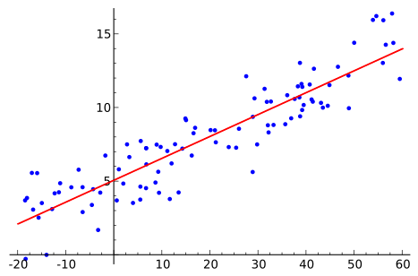

# linreg

This is a simple implementation of linear regression using a gradient descent algorithm. The goal is to find the best fitting line for a multi-dimensional dataset.

<p align="center">
    
</p>

The algorithm will return the best fitting line for any multidimensional dataset that supports linear regression.

## Features

* Fallback to using the normal equation method for datasets with less than 10,000 features
* Automatic feature scaling
* Customizable parameters (learning rate, iterations)
* Multidimensional data support

## Data files

Data files must be in CSV format, with the following structure:

```
x1,x2,y
200,300,32
203,231,42
231,232,13
``` 

Where ``x1,x2,y`` constitutes the header of the data. This project supports multidimensional data, feel free to use any number of features.

## Installation

This project relies on the Python 3 package [NumPy](http://www.numpy.org/). To install the requirements use Python pip: 

```console
$ pip install -r requirements.txt
```

I recommend that you use a [virtual environment](http://docs.python-guide.org/en/latest/dev/virtualenvs/) when installing your dependencies.

## Usage

This project can be used from either the terminal, or as an imported package.

### Terminal

```console
$ python linreg.py mydataset.csv
Found the following parameters that best fits the data:
intercept = 2.0, size = 6499.998156236331
```

The following arguments are available:

- ``-h``,``--help``: Display help on usage
- ``-a``,``--alpha``: Set the learning rate manually
- ``-i``,``--iterations``: Set the number of iterations manually
- ``-f``,``--force``: Force gradient descent and skip the normal equation method

### Imported package

```python
import linreg
import numpy as np

features = np.asmatrix(np.random.rand(3, 3))
values = np.random.rand(3, 1)

# Feature scaling
scales = linreg.scalefeatures(features)

# Gradient descent
iterations = 1500
alpha = 0.01
print(linreg.gradientdescent(features, values, 1500, 0.01))

# Cost
parameters = np.random.rand(3, 1)
print(linreg.cost(features, values, parameters))
```

## Requirements

Python 3+ is required, as well as the NumPy package.

## License

Code copyright 2018 Søren Qvist Christensen. Code released under [the MIT license](LICENSE).